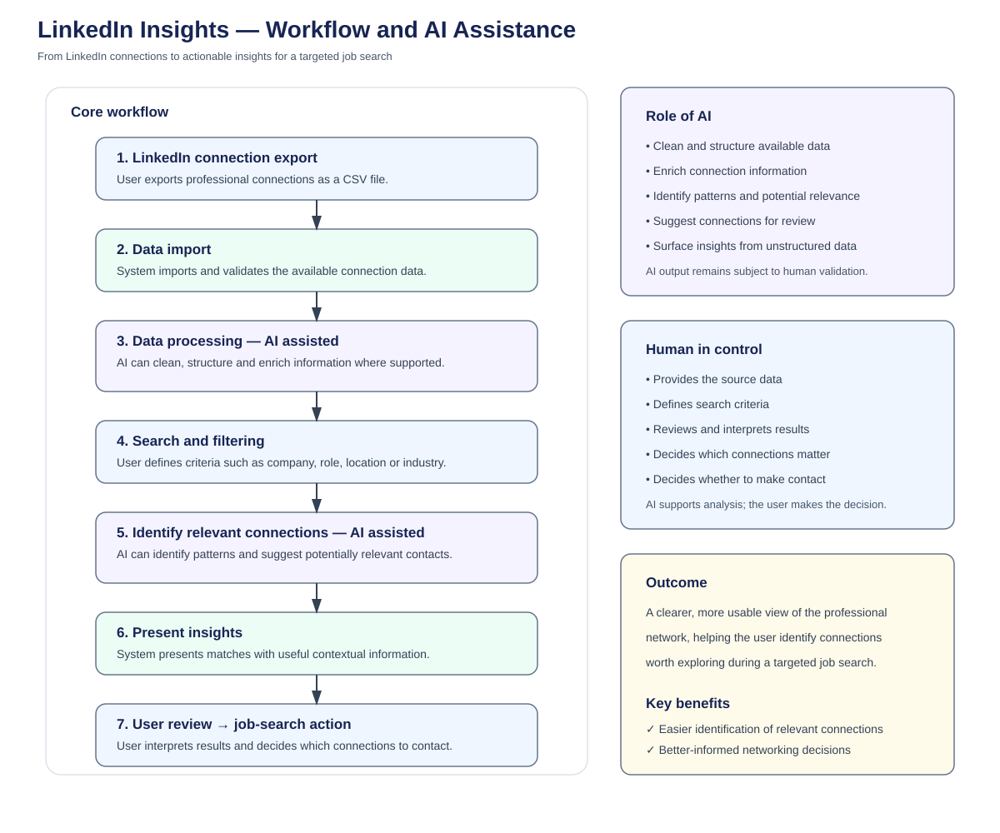

# LinkedIn Insights — Requirements Analysis Case Study

## Overview

**LinkedIn Insights** is an AI-assisted prototype designed to help job seekers make better use of their professional LinkedIn network.

The prototype takes a LinkedIn connection export and turns the available information into a more searchable and useful view of professional connections, helping the user identify people who may be relevant to a job search.

This case study applies a requirements-engineering approach to the project.

The working prototype is maintained in the [LinkedIn Insights repository](https://github.com/Elly11Nov/linkedin-buddy-dash).

The purpose of this case study is to demonstrate how a business problem can be analysed and translated into requirements, data needs, workflows, user interactions and acceptance criteria.

---

## 1. The Problem

A LinkedIn network may contain hundreds or thousands of professional connections, but the information is not necessarily organised around a specific job-search objective.

A job seeker may need to answer questions such as:

- Which connections work at a target company?
- Which contacts have a relevant role or industry background?
- Where are potentially useful connections located?
- Which people may be worth contacting about an opportunity?
- What information is available to help decide whether a connection is relevant?

Searching through the network manually can make this process time-consuming.

### Problem statement

> A job seeker needs a structured way to analyse and search their professional network so that they can identify relevant connections during a targeted job search.

The problem is therefore not simply to display LinkedIn data.

The solution needs to help the user move from:

**network data → relevant information → informed action**

---

## 2. User

### Primary user

**Job seeker**

The user has an exported LinkedIn connection dataset and wants to identify professional contacts who may be useful for a particular job search.

### User goal

> Identify and evaluate professional connections that may be relevant to a job search.

The user remains responsible for deciding which connections are actually relevant and whether to make contact.

---

## 3. Business Objectives

The solution should help the user:

- Make a large connection dataset easier to search
- Identify potentially relevant professional connections
- Add useful context to connection information
- Support more targeted networking
- Reduce the effort required to find relevant contacts
- Support better-informed job-search decisions

The objective is **decision support**, rather than automated networking.

---

## 4. Scope

### In scope

The prototype considers:

- Importing LinkedIn connection data
- Structuring connection information
- Searching and filtering connections
- Filtering by relevant attributes such as company, role, location or industry
- Identifying potentially relevant connections
- Presenting connection information and insights
- Supporting iterative refinement of search criteria

### Out of scope

The prototype does not attempt to:

- Automatically send LinkedIn messages
- Contact connections without user involvement
- Make employment decisions for the user
- Guarantee that a connection is relevant
- Replace the user's judgement about networking
- Require direct access to LinkedIn

The scope is focused on **network analysis and decision support**.

---

## 5. Functional Requirements

The requirements can be grouped into several areas.

### Data import

The system should allow the user to provide an exported connection dataset.

The available information should be imported into a structure that can be analysed.

### Data processing

The system should process the imported information so that it can be searched, filtered and presented consistently.

AI may assist with cleaning, structuring or enriching information where appropriate.

### Search and filtering

The system should allow the user to search or filter connections using relevant criteria.

Examples include:

- Company
- Role
- Location
- Industry

### Relevance analysis

The system should help identify connections that may be relevant to the user's search criteria.

AI can support this analysis by identifying patterns or potential matches.

The result should be treated as a suggestion for user review rather than an authoritative classification.

### Results presentation

The system should present relevant connection information in a form that allows the user to review and interpret the results.

### Iteration

The user should be able to refine search criteria and explore different results.

This creates a feedback loop between analysis and user judgement.

---

## 6. Non-Functional Considerations

### Usability

The interface should make it easy to search, filter and interpret connection information.

### Clarity

Results should provide enough context for the user to understand why a connection may be relevant.

### Transparency

Where AI-assisted analysis is used, the user should be able to distinguish suggestions from information directly present in the source data.

### Performance

The solution should process the available connection data efficiently enough to support interactive exploration.

### Privacy

Connection data may contain personal and professional information.

A production implementation would therefore require appropriate controls for data handling, storage and access.

---

## 7. Data Requirements

The solution works with information associated with professional connections.

A simplified information model is:

    Connection
        ├── Person
        ├── Company
        ├── Role
        ├── Location
        └── Industry
                │
                ↓
          Search criteria
                │
                ↓
        Relevance analysis
                │
                ↓
          User decision

The analysis needs to distinguish between:

- Information directly available in the imported data
- Information derived or structured from that data
- AI-generated suggestions
- User-defined search criteria
- User interpretations and decisions

This distinction is important when assessing the reliability of the resulting insights.

---

## 8. Business Rules

The system's behaviour depends on the relationship between the user's criteria and the available connection information.

For example:

    User search criteria
            ↓
    Available connection data
            ↓
    Matching / relevance analysis
            ↓
    Potentially relevant connections
            ↓
    User review

A key business rule is that **potential relevance does not equal confirmed relevance**.

The system may identify a connection because the available information matches selected criteria, but the user must decide whether that person is genuinely useful for the particular job-search context.

This is an important boundary between automated analysis and human judgement.

---

## 9. Use Case

### Identify Relevant Connections

**Actor:** Job seeker

**Goal:** Identify professional connections that may be relevant to a specific job-search objective.

### Preconditions

- The user has an exported connection dataset.
- The connection data can be imported into the application.
- The user has a job-search objective or search criteria.

### Main flow

1. The user imports the connection dataset.
2. The system validates and processes the available data.
3. The user defines search criteria.
4. The system searches and filters the available connections.
5. AI-assisted analysis may identify potentially relevant connections.
6. The system presents the results with available contextual information.
7. The user reviews and interprets the results.
8. The user decides whether a connection is worth exploring.
9. The user may refine the search criteria and repeat the analysis.

### Alternative flow

If no useful matches are found:

1. The system communicates that no matching results were identified.
2. The user can modify the search criteria.
3. The analysis is repeated.

---

## 10. User Stories

### Search connections

> As a job seeker, I want to search my professional connections by company, role or location so that I can find people relevant to a job opportunity.

### Identify relevant contacts

> As a job seeker, I want the system to identify potentially relevant connections so that I can focus my networking efforts.

### Review context

> As a job seeker, I want to see useful information about a connection so that I can decide whether the person is worth contacting.

### Refine the search

> As a job seeker, I want to adjust my search criteria so that I can explore different parts of my professional network.

---

## 11. Acceptance Criteria

### Search

- The user can enter or select supported search criteria.
- The system applies the criteria to the available connection data.
- Matching results are displayed to the user.

### Relevance analysis

- The system can identify potentially relevant connections based on supported criteria.
- AI-generated suggestions are distinguishable from source data where appropriate.
- The user can review the suggested connections before taking action.

### Results

- Connection information is presented in a readable format.
- Available contextual information is shown with the relevant connection.
- The user can interpret the results without relying solely on an AI-generated explanation.

### Iteration

- The user can change search criteria.
- The system can produce updated results.
- The user can compare or explore different searches.

---

## 12. Assumptions and Constraints

### Known

- The prototype uses exported LinkedIn connection data.
- The prototype is intended to support job searching and networking.
- Search and filtering are central to the workflow.
- AI can be used to assist with analysis.

### Assumptions

- The exported data contains enough information to support the selected analysis.
- The user has a specific search objective or criteria.
- The user understands that connection relevance cannot always be determined from structured data alone.

### Constraints

- The quality of the analysis depends on the quality and completeness of the source data.
- AI-generated relevance suggestions require human review.
- A production system would need appropriate privacy and data-handling controls.

Making these distinctions explicit prevents assumptions from becoming hidden requirements.

---

## 13. Potential Gaps and Questions

Further requirements elicitation would be needed before developing a production system.

Questions include:

- Which LinkedIn export formats should be supported?
- Which connection attributes should be searchable?
- How should relevance be defined?
- Should the user be able to define their own relevance criteria?
- What additional sources could be combined with connection data?
- How should duplicate or incomplete records be handled?
- How should AI-generated enrichment be verified?
- Should data be stored between sessions?
- What privacy and retention requirements would apply?
- Should the system support multiple job-search objectives at the same time?

These questions are deliberately left open rather than resolved by assumption.

---

## 14. Prioritisation

A possible prioritisation for an initial version is:

| Priority | Requirement |
|---|---|
| Must have | Import connection data |
| Must have | Search and filter connections |
| Must have | Present relevant connection information |
| Must have | Allow user review of results |
| Should have | AI-assisted relevance analysis |
| Should have | Additional contextual enrichment |
| Could have | Advanced relevance scoring |
| Could have | Additional data sources |
| Won't have | Automated outreach |

This keeps the core purpose focused on helping the user **find and evaluate relevant connections**.

---

## 15. AI-Assisted Analysis

AI can support several stages of the workflow.

Potential uses include:

- Cleaning and structuring imported information
- Identifying patterns in connection data
- Enriching information where reliable sources are available
- Suggesting potentially relevant connections
- Grouping connections according to user-defined criteria
- Identifying information gaps
- Supporting interpretation of unstructured information

A controlled workflow is:

    Connection data
          ↓
    AI-assisted processing
          ↓
    Potential insights
          ↓
    Human review
          ↓
    User decision

AI does not decide which connection the user should contact.

The user remains responsible for interpreting the result and deciding what action to take.

---

## 16. Human-in-the-Loop Workflow

The human/AI boundary is an important part of the solution design.

    Human
      │
      ├── Provides source data
      ├── Defines search objective
      ├── Defines or refines criteria
      │
      ↓
    System + AI
      │
      ├── Processes data
      ├── Identifies patterns
      ├── Suggests potentially relevant connections
      │
      ↓
    Human
      │
      ├── Reviews results
      ├── Interprets context
      └── Decides whether to act

This illustrates a broader principle used throughout the portfolio:

> **AI can accelerate analysis, but human judgement remains responsible for the decision.**

---

## 17. Workflow Model

The end-to-end workflow is:

    LinkedIn connection export
              ↓
          Data import
              ↓
       Data processing
        (AI assisted)
              ↓
       Search / filtering
              ↓
     Relevance analysis
        (AI assisted)
              ↓
       Present insights
              ↓
         User review
              ↓
      Job-search action
              ↓
       Refine and iterate

### Workflow diagram

The workflow is intentionally iterative.

The user may refine the criteria after reviewing the results and run the analysis again.

---

## 18. Requirements to Prototype

The relationship between the requirements analysis and the existing prototype can be represented as:

    Job-search problem
            ↓
    Requirements analysis
            ↓
    Data requirements
            ↓
    Search and relevance requirements
            ↓
    User stories
            ↓
    Workflow and business rules
            ↓
    Solution design
            ↓
    Prototype
            ↓
    User validation

The existing LinkedIn Insights prototype represents the solution-design and implementation stage.

This repository focuses on the requirements and analysis layer behind the solution.

---

## 19. Validation

The requirements should be validated against the intended user outcome.

Key questions include:

- Does the solution make a professional network easier to analyse?
- Can the user find relevant connections efficiently?
- Are search criteria clear?
- Are AI-generated suggestions useful without being treated as facts?
- Can the user understand the information presented?
- Does the user remain in control of the final decision?
- Can the workflow be repeated and refined?

Prototype testing can reveal requirements that were unclear or incomplete during the initial analysis.

---

## 20. Requirements Traceability

A simplified traceability chain is:

    Job-search need
          ↓
    Requirement
          ↓
    User story
          ↓
    Search / relevance rule
          ↓
    Acceptance criteria
          ↓
    Prototype behaviour
          ↓
    User validation

This provides a connection between the original user problem and the behaviour of the resulting solution.

---

## Conclusion

LinkedIn Insights demonstrates how a broad problem — making a professional network more useful during a job search — can be translated into structured requirements, data needs, business rules, use cases, user stories and acceptance criteria.

It also demonstrates a practical approach to AI-enabled workflow design.

The important distinction is between:

    Data
      ↓
    AI-assisted analysis
      ↓
    Potential insight
      ↓
    Human interpretation
      ↓
    User decision

The objective is not to automate the networking decision.

It is to make the information easier to analyse so that the user can make a better-informed decision.

> **The value of AI is not replacing the decision-maker; it is helping the decision-maker work with information more effectively.**

---

## Related Work

- [LinkedIn Insights prototype](https://github.com/Elly11Nov/linkedin-buddy-dash)
- [Requirements Analysis](../docs/requirements-analysis.md)
- [Requirements Engineering Approach](../docs/requirements-engineering-approach.md)
- [Deal Compass case study](deal-compass.md)
- [LinkedIn Insights workflow diagram](../diagrams/linkedin-insights-workflow.svg)

## Portfolio Note

This case study is based on my own application prototype and is presented as a portfolio example of requirements analysis, workflow design and AI-assisted solution modelling.

The LinkedIn data used by the prototype is user-provided. Any AI-assisted enrichment or relevance analysis should be treated as a suggestion requiring appropriate validation.
